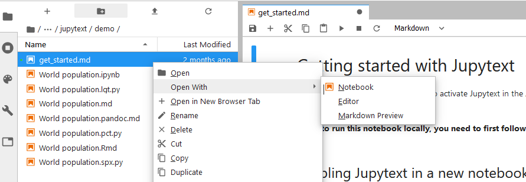

# Welcome to `codema-dev` projects!

Download, wrangle & explore all Irish energy datasets used by the `codema-dev` team

> ⚠️ Some projects use closed-access datasets for which you will need permission from the `codema-dev` team to use! 

## Setup

Run the projects in your browser by clicking on the following buttons:

---

[](https://mybinder.org/v2/gh/codema-dev/projects/main) ⬅️ click me to launch workspace

<details>
<summary>⬅️ click me for a setup guide</summary>

> Setting up this workspace can take a few minutes.

- Double click on the project you want to open

- Right click on the `README.md` file, `Open With > Notebook` and run all cells



</details>

---

[](https://gitpod.io/#https://github.com/codema-dev/projects) ⬅️ click me launch workspace

<details>
<summary>⬅️ click me for a setup guide</summary>

- Double click on the project you want to open

- Change directory to a project folder by right clicking the project and selecting `Open in Integrated Terminal`

- OR in your Terminal run: `cd NAME-OF-PROJECT` 

    > So the prompt shows `projects/NAME-OF-PROJECT`

- Right click `README.md > Open Preview` to view the project guide

**Note:**

- **If the Terminal disappears** from the bottom of your screen click `≡ > Terminal > New Terminal` 
</details>

---

💻 Running locally

<details>
<summary>⬅️ click me for a setup guide</summary>

**Easy**:

- Install [Anaconda](https://www.anaconda.com/products/individual)
- [Import the `environment.yml`](https://docs.anaconda.com/anaconda/navigator/tutorials/manage-environments/#importing-an-environment) of a project via Anaconda Navigator
- Launch [VSCode from Anaconda Navigator](https://docs.anaconda.com/anaconda/user-guide/tasks/integration/vscode/)
- Install [Python for VSCode](https://marketplace.visualstudio.com/items?itemName=ms-python.python)
- Follow the GitPod instructions

**Lightweight**:

- Install: 
    - [VSCode](https://code.visualstudio.com/Download)
    - [mambaforge](https://github.com/conda-forge/miniforge)
    - [Python for VSCode](https://marketplace.visualstudio.com/items?itemName=ms-python.python)

- Install all project dependencies via each project's `environment.yml` in your Terminal:
    ```{code-cell} bash
    conda create env --file environment.yml && conda activate NAME-OF-ENVIRONMENT
    ```
    > Click the `environment.yml` to view the environment name

- Follow the GitPod instructions
</details>

---

## Why?

In previous years all data wrangling was performed solely using `Microsoft Excel`.   Although this is useful for small datasets, it soon becomes a burden when working with multiple, large datasets.

For example, when generating the previous residential energy estimates it was necessary to create up to 16 separate workbooks for each local authority each containing as many as 15 sheets, as the datasets were too large to fit into a single workbook.  Although each workbook performed the same logic to clean and merge datasets, changing this logic meant changing all of the separate workbooks one at a time.

Moving to open-source scripting tools enabled using logic written down in scripts (or text files) to wrangle and merge data files, thus separating data from the logic operating on it.  This means that if any dataset is updated, re-generating outputs is as simple as running a few scripts.  Furthermore these scripts can be shared without sharing the underlying datasets.  

---

## Keeping Binder up to date

To run this repository in Binder it is necessary to create a single `environment.yml` which contains the dependencies required for all projects.  Binder uses this every time someone clicks on the Binder button to create a workspace for this repository.

To update this file run:

```bash
conda env create --file environment.meta.yml --name codema-dev-projects
conda activate codema-dev-projects
invoke merge-environment-ymls
```

`invoke` runs the function `merge_environment_ymls` from `tasks.py` to merge the `environment.yml` from each project and from `environment.meta.yml` together into a single `environment.yml` 